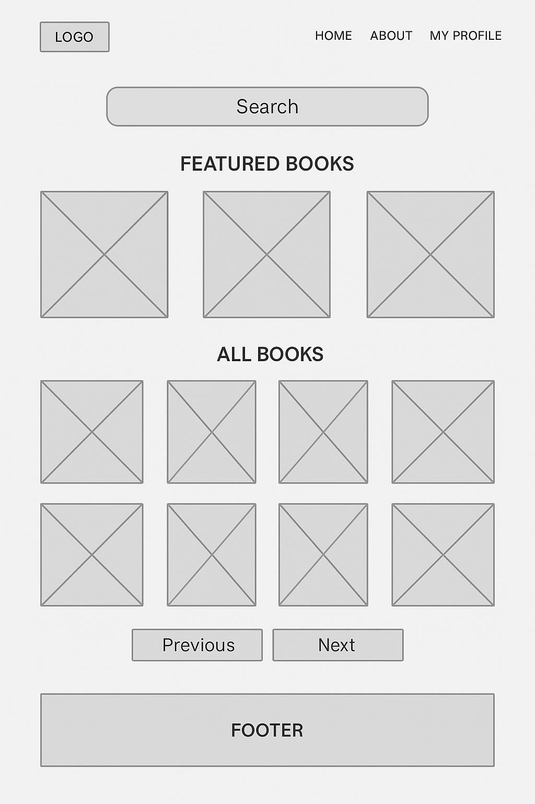
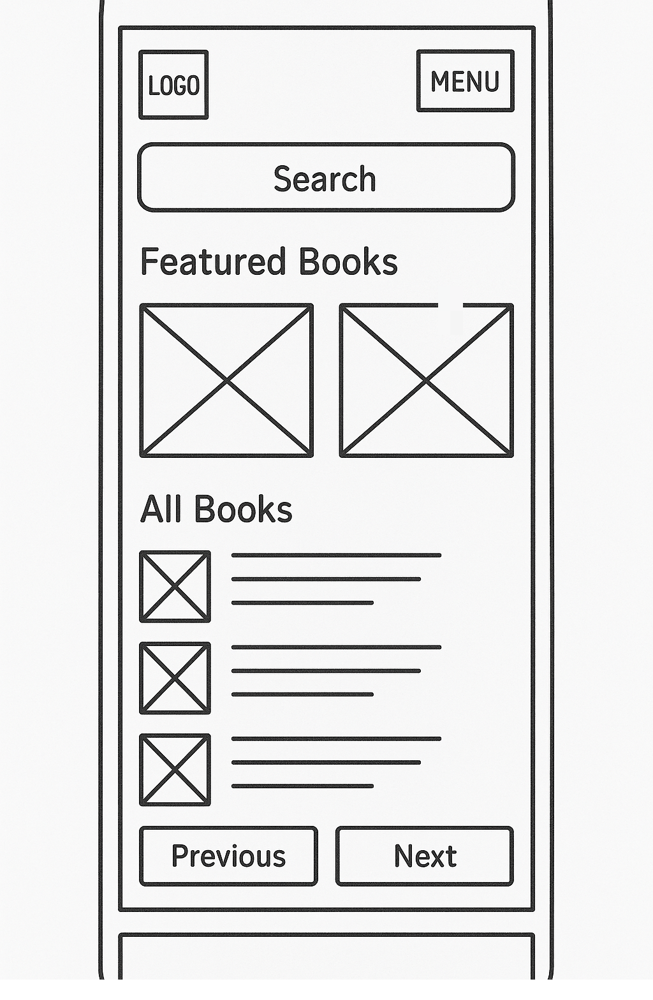
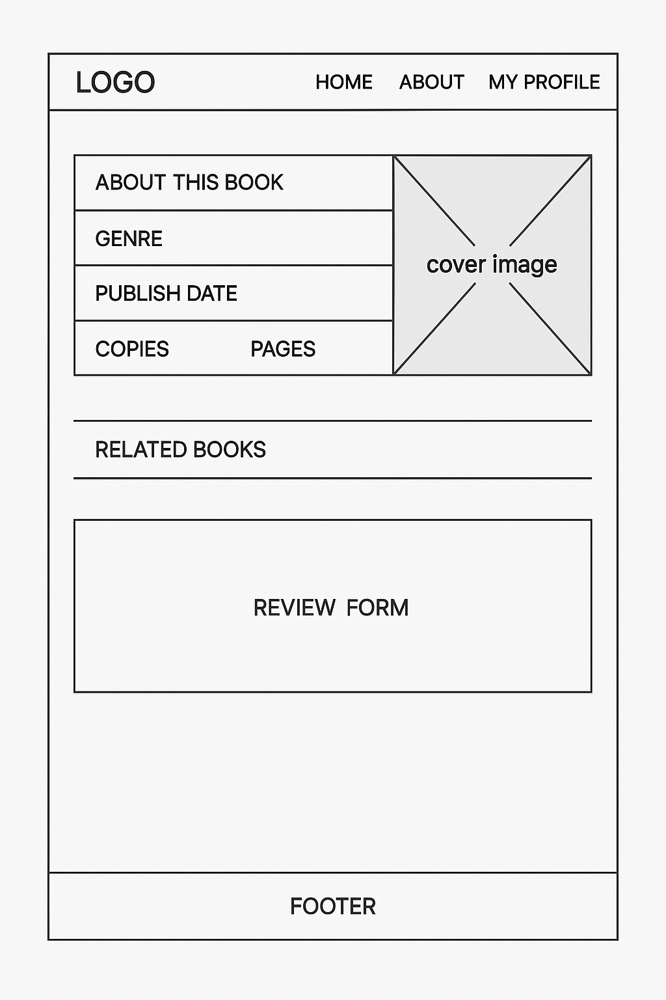
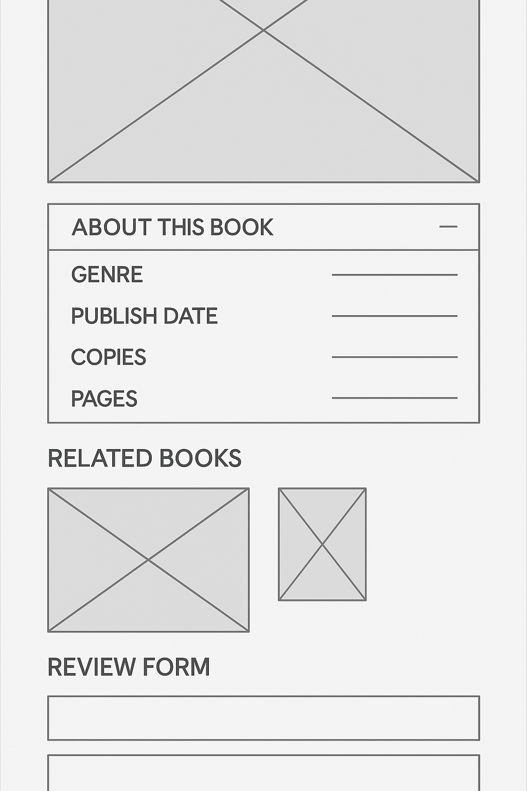
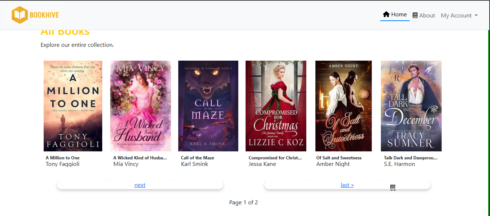
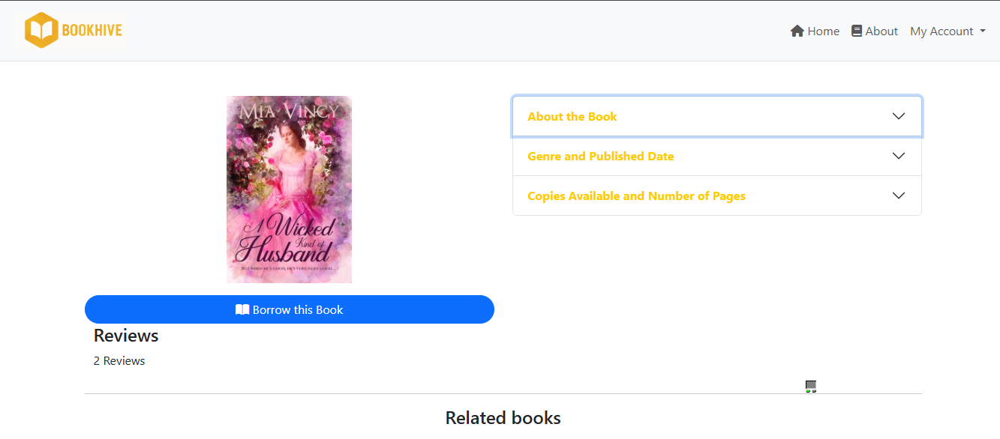
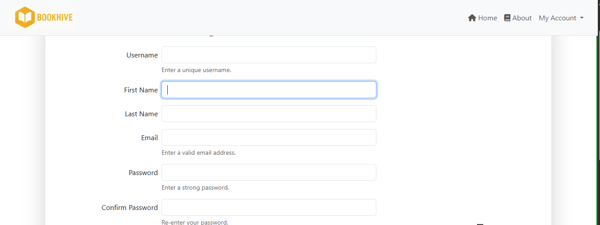
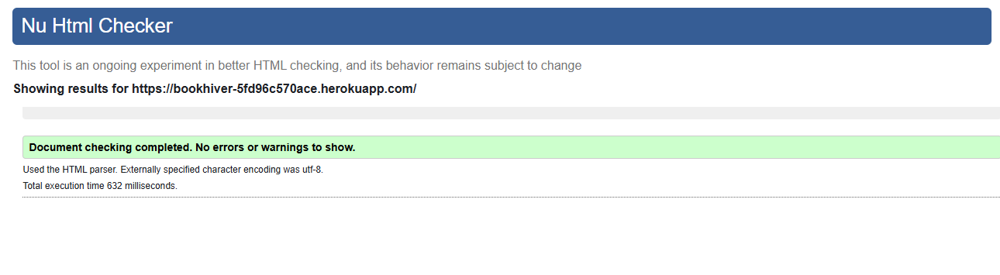
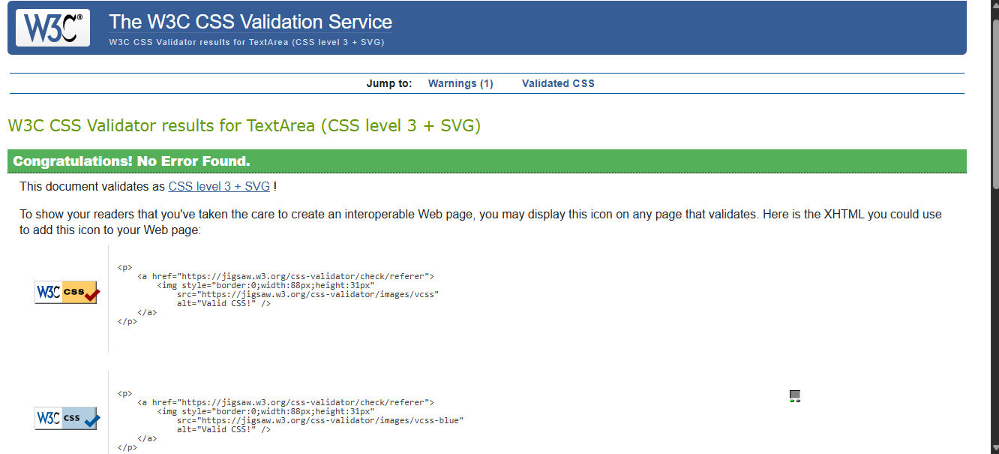

<h1 align='center'>BookHive</h1>

BookHive is a Django-based web application and Minimum Viable Product (MVP) designed to showcase core full-stack functionality. The platform enables users to register, log in, browse books, post reviews, and initiate borrowing.

This project demonstrates my ability to build scalable, modular Django applications with clean UI using Bootstrap. While this version includes essential features, it is intentionally lean to highlight core functionality. The UX and feature set can be expanded based on future goals or user feedback.

## 📚 Table of Contents

* [User Experience](#user-experience)

  * [For General Users](#for-general-users)
  * [For Admin Users](#for-admin-users)
  * [Accessibility Considerations](#accessibility-considerations)
* [Wireframes](#wireframes)
* [Screenshots](#screenshots)
* [Features](#features)
* [Fonts](#fonts)
* [Tech Stack](#tech-stack)
* [Manual Testing](#manual-testing)
* [Automatic Test](#automatic-test)
* [HTML and CSS Validation](#html-and-css-validation)
* [Installation](#installation)
* [Deployment](#deployment)
* [Acknowledgment](#acknowledgment)
* [License](#license)

## 🧠 User Experience

### ✅ For General Users

As a regular user of **BookHive**, I want to:

* Access the website seamlessly across all devices — desktops, laptops, tablets, and smartphones.
* Navigate a clean, consistent, and responsive interface with intuitive menus.
* Browse for books and search for books by title.
* View detailed information about each book, including title, author, cover image, and description.
* Register or log in quickly using a username.
* Leave reviews for books and read others’ feedback to help with selection.
* Borrow books with clear instructions and receive confirmation or error messages.
* Return to the homepage or previous browsing state without confusion.
* Receive immediate visual feedback when submitting forms.
* View confirmation messages after actions like borrowing or reviewing.
* Restart or return to the main catalog easily.

### 🔧 For Admin Users

As an admin, I want to:

* Access a secure, user-friendly admin interface.
* Add or update books with fields like title, author, description, category, and cover image.
* Moderate or delete user reviews.
* View and manage borrowing activity.
* Access the admin dashboard via a protected URL.
* Receive validation messages when managing books.
* Upload media through integrations like Cloudinary.

### ♿ Accessibility Considerations

* Use semantic HTML and heading structure for screen readers.
* Ensure color contrast for readability.
* Include `alt` text for all book cover images.
* Support keyboard navigation.
* Show clear error messages and form validation.

---

## 📊 Wireframes

**Desktop**


**Mobile**


**Book Details - Desktop**


**Book Details - Mobile**


---

## 📸 Screenshots

### 📚 Home Page



### 📘 Book Detail Page



### 🔐 Login Page


### 🔑 Register Page



---

## 🚀 Features

* 🔍 Search for books by title
* 📝 User registration and login
* 💬 Review system for each book
* 📷 Book cover image upload via Cloudinary
* 🔐 Authentication using `django-allauth`
* 📄 Pagination for listings
* 🖼️ Responsive design with Bootstrap 5

---

## 🎨 Fonts

* PT Sans was used as the main font.

## 🛠️ Tech Stack

* **Backend**: Django 5+
* **Frontend**: HTML, CSS (Bootstrap), JavaScript
* **Database**: PostgreSQL
* **Media Storage**: Cloudinary
* **Authentication**: `django-allauth`

---

## 💪 Manual Testing

| Test Case                    | Action                               | Expected Outcome                         |
| ---------------------------- | ------------------------------------ | ---------------------------------------- |
| Register with valid inputs   | Fill in form with valid data         | Account is created and user is logged in |
| Register with duplicate user | Use existing username                | Error: "This username is already taken." |
| Login with correct details   | Enter valid credentials              | User is logged in                        |
| Login with wrong password    | Enter valid username, wrong password | Error message shown                      |

| Test Case          | Action           | Expected Outcome                |
| ------------------ | ---------------- | ------------------------------- |
| View homepage      | Visit `/`        | Featured and latest books shown |
| Click a book card  | Click on a book  | Redirects to book detail page   |
| Filter by category | Click a category | Only relevant books shown       |
| Search for a book  | Use search input | Matching books displayed        |

### 📝 Reviews and Comments

| Test Case       | Action                         | Expected Outcome              |
| --------------- | ------------------------------ | ----------------------------- |
| Add a review    | Fill form on book page         | Comment added and displayed   |
| Edit a review   | Click "Edit", update, and save | Updated comment shown         |
| Delete a review | Click "Delete" and confirm     | Comment removed from the page |

---

## 🚀 Automatic Test

To run automated tests:

```bash
python manage.py test
```

---

## ✅ HTML and CSS Validation

Validated using [W3C HTML Validator](https://validator.w3.org/) and [W3C CSS Validator](https://jigsaw.w3.org/css-validator/):

* 
* 

---

## ⚙️ Installation

1. Clone the repository:

```bash
git clone https://github.com/enocol/bookhive.git
cd bookhive
```

---

## 🌐 Deployment

This app is ready for deployment on Heroku.

Recommendations:

* Set `DEBUG = False`
* Configure `ALLOWED_HOSTS`
* Use WhiteNoise or S3 for static/media files
* Set up PostgreSQL in production

---

## 🙌 Acknowledgment

**Author**: BookHive was created by Enoh Collins as a full-stack Django portfolio project. Feel free to fork, star, and contribute!

---

## 📜 License

MIT License — see LICENSE file for details.

---

### 🔹 Suggestions for Improvement

* Add social authentication (Google, GitHub)
* Implement book availability status
* Add borrowing history for users
* Enable book return feature
* Add user avatars and profile editing
