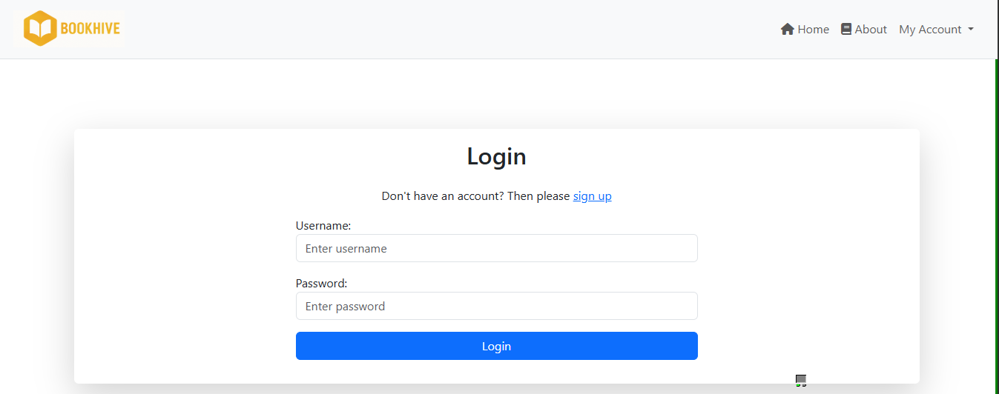

BookHive is a Django-based web application and Minimum Viable Product (MVP) designed to showcase core full-stack functionality. The platform enables users to register, log in, browse books, post reviews, and initiate borrowing.

This project demonstrates my ability to build scalable, modular Django applications with clean UI using Bootstrap. While this version includes essential features, it is intentionally lean to highlight core functionality. The UX and feature set can be expanded based on future goals or user feedback.

## 📚 Table of Contents

- [User Experience](#user-experience)

  - [For General Users](#for-general-users)
  - [For Admin Users](#for-admin-users)
  - [Accessibility Considerations](#accessibility-considerations)

- [Wireframes](#wireframes)
- [Screenshots](#screenshots)
- [Features](#features)
- [Fonts](#fonts)
- [Tech Stack](#tech-stack)
- [Manual Testing](#manual-testing)
- [Automatic Test](#automatic-test)
- [HTML and CSS Validation](#html-and-css-validation)
- [Installation](#installation)
- [Deployment](#deployment)
- [Acknowledgment](#acknowledgment)
- [License](#license)

## 🧠 User Experience

### ✅ For General Users

As a regular user of **BookHive**, I want to:

- Access the website seamlessly across all devices — desktops, laptops, tablets, and smartphones.
- Navigate a clean, consistent, and responsive interface with intuitive menus.
- Browse for books and search for books by title.
- View detailed information about each book, including title, author, cover image, and description.
- Register or log in quickly using a username.
- Leave reviews for books and read others’ feedback to help with selection.
- Borrow books with clear instructions and receive confirmation or error messages.
- Return to the homepage or previous browsing state without confusion.
- Receive immediate visual feedback when submitting forms.
- View confirmation messages after actions like borrowing or reviewing.
- Restart or return to the main catalog easily.

### 🔧 For Admin Users

As an admin, I want to:

- Access a secure, user-friendly admin interface.
- Add or update books with fields like title, author, description, category, and cover image.
- Moderate or delete user reviews.
- View and manage borrowing activity.
- Access the admin dashboard via a protected URL.
- Receive validation messages when managing books.
- Upload media through integrations like Cloudinary.

### ♿ Accessibility Considerations

- Use semantic HTML and heading structure for screen readers.
- Ensure color contrast for readability.
- Include `alt` text for all book cover images.
- Support keyboard navigation.
- Show clear error messages and form validation.

---

#

## Wire Frames

Desktop


Mobile


Book details desktop


Book Detail Mobile


## 📸 Screenshots

### 📚 Home Page (Book List)


### 📘 Book Detail Page


### 🔐 Login Page



### Register page


## 🚀 Features

- 🔍 Search for books by title
- 📝 User registration and login
- 💬 Review system for each book
- 📷 Book cover image upload via Cloudinary
- 🔐 Authentication using `django-allauth`
- 📄 Pagination for listings
- 🖼️ Responsive design with Bootstrap 5

---

## 🎨 Fonts

- PT Sans was used as the main font.

## 🛠️ Tech Stack

- **Backend**: Django 5+
- **Frontend**: HTML, CSS (Bootstrap), JavaScript
- **Database**: PostgreSQL
- **Media Storage**: Cloudinary
- **Authentication**: `django-allauth`

---

## Manaul Test

| Test Case                    | Action                                    | Expected Outcome                                 |
| ---------------------------- | ----------------------------------------- | ------------------------------------------------ |
| Register with valid inputs   | Fill in registration form with valid data | Account is created and user is logged in         |
| Register with duplicate user | Use an existing username                  | Error message: "This username is already taken." |
| Login with correct details   | Enter valid username and password         | User is logged in successfully                   |
| Login with wrong password    | Enter valid username but wrong password   | Error message is displayed                       |

| Test Case          | Action                                         | Expected Outcome                                |
| ------------------ | ---------------------------------------------- | ----------------------------------------------- |
| View homepage      | Visit `/`                                      | Featured and latest books are displayed         |
| Click a book card  | Click on a book from homepage or category list | Redirected to book detail page with description |
| Filter by category | Click on category (e.g., Fiction, Science)     | Only books from that category are shown         |
| Search for a book  | Use the search input with a keyword            | Matching books are shown                        |

📚 Book Browsing and Details
| Test Case | Action | Expected Outcome |
| ------------------ | ---------------------------------------------- | ----------------------------------------------- |
| View homepage | Visit `/` | Featured and latest books are displayed |
| Click a book card | Click on a book from homepage or category list | Redirected to book detail page with description |
| Filter by category | Click on category (e.g., Fiction, Science) | Only books from that category are shown |
| Search for a book | Use the search input with a keyword | Matching books are shown |

💬 4. Reviews and Comments
| Test Case | Action | Expected Outcome |
| --------------- | --------------------------------------------- | ---------------------------------- |
| Add a review | Fill comment form on a book page | Comment is added and displayed |
| Edit a review | Click "Edit", update the comment in the modal | Updated comment is saved and shown |
| Delete a review | Click "Delete", confirm action | Comment is removed from the page |

## Other testing:

✅ Functional Testing

| Feature                | Test Description                                               | Status   |
| ---------------------- | -------------------------------------------------------------- | -------- |
| User Registration      | Users can register with valid credentials and become borrowers | ✅ Passed |
| Login/Logout           | Registered users can log in and out securely                   | ✅ Passed |
| Book Listing           | All books display with title, image, and details               | ✅ Passed |
| Book Search            | Users can search for books by title or description             | ✅ Passed |
| Book Borrowing         | Logged-in users can borrow available books                     | ✅ Passed |
| Book Returning         | Users can return borrowed books and update their status        | ✅ Passed |
| Review Submission      | Users can add, edit, and delete reviews                        | ✅ Passed |
| Pagination             | Book listings are paginated after a set limit                  | ✅ Passed |
| Admin Controls         | Admin users can manage books and borrowers via the admin panel | ✅ Passed |

🎯 Usability Testing

| Area                     | Test Description                                                         | Status   |
| ------------------------ | ------------------------------------------------------------------------ | -------- |
| Form Validation          | All forms provide user-friendly error messages for invalid input         | ✅ Passed |
| Navigation               | Menus and navigation links are intuitive and accessible                  | ✅ Passed |
| Feedback                 | Success/error messages shown after actions like borrow, return, register | ✅ Passed |
| Modal Reviews (if used)  | Edit/delete review modals are functional and accessible                  | ✅ Passed |
| Active Link Highlighting | Navigation bar highlights current page                                   | ✅ Passed |

📱 Responsive Design Testing

| Device/Screen Size      | Test Description                                                              | Status   |
| ----------------------- | ----------------------------------------------------------------------------- | -------- |
| Mobile (≤ 768px)        | Content adapts properly, cards stack vertically, nav collapses into hamburger | ✅ Passed |
| Tablet (768px - 1024px) | Grid adjusts, buttons and forms remain accessible                             | ✅ Passed |
| Desktop (≥ 1024px)      | All components appear consistently with full layout                           | ✅ Passed |
| Image Scaling           | Book cover images maintain aspect ratio and fit container                     | ✅ Passed |


🗃️ Data Management Testing

| Data Layer                 | Test Description                                                           | Status   |
| -------------------------- | -------------------------------------------------------------------------- | -------- |
| Database Migrations        | All models and fields migrate without errors                               | ✅ Passed |
| Borrower/User Sync         | User creation links to borrower record via OneToOne relationship           | ✅ Passed |
| Book Availability Tracking | Borrowed books update number of copies available                           | ✅ Passed |
| Review Linking             | Reviews are correctly associated with users and books                      | ✅ Passed |
| Edge Cases                 | Handles duplicate registrations, invalid borrow attempts, and missing data | ✅ Passed |


## Automatic test

### To run automatic test, on the terminal, run the following command:

- python manage.py test

## ✅ HTML and CSS Validation

The W3.org html validator was use to validate the project using the deployed link

- https://bookhiver-5fd96c570ace.herokuapp.com/
  

-

Validated using [W3C HTML Validator](https://validator.w3.org/) and [W3C CSS Validator](https://jigsaw.w3.org/css-validator/):

---

## 🧹 JavaScript Linting with ESLint

This project uses **ESLint** to lint and automatically fix JavaScript code in the static files.

### 📦 Setup Instructions

1. **Install ESLint:**

   ```bash
   npm install eslint --save-dev
   ```

2. **Initialize ESLint:**

   ```bash
   npx eslint --init
   ```

   Recommended setup during prompts:

   - Purpose: _To check syntax, find problems, and enforce code style_
   - Module type: _JavaScript modules_
   - Framework: _None_
   - Environment: _Browser_
   - Config format: _JavaScript or JSON_

3. **Organize JS Files:**
   Ensure your JavaScript files are stored inside your app’s `static/js/` folder.

---

### 🛠 Linting and Auto-Fixing

#### 🔍 Run Lint:

```bash
npx eslint yourapp/static/js/**/*.js
```

#### 🔧 Auto-Fix Issues:

```bash
npx eslint yourapp/static/js/**/*.js --fix
```

#### 💡 Add to `package.json` Scripts:

```json
"scripts": {
  "lint": "eslint yourapp/static/js/**/*.js",
  "lint:fix": "eslint yourapp/static/js/**/*.js --fix"
}
```

Then run:

```bash
npm run lint
npm run lint:fix
```

---

### ⚙️ Optional: Auto-Fix on Save (VSCode)

If using **Visual Studio Code**, add this in `.vscode/settings.json`:

```json
{
  "editor.codeActionsOnSave": {
    "source.fixAll.eslint": true
  },
  "eslint.validate": ["javascript"]
}
```

Make sure the ESLint extension is installed in VSCode.

## ⚙️ Installation

1. Clone the repository:

```bash
git clone https://github.com/enocol/bookhive.git
cd bookhive
npm install
```

---

### 🚀 Deployment Procedure

To deploy BookHive to a live production environment (e.g., Heroku), follow these steps:

#### 1. Make sure in your settings.py file in the project, debug is set to False before commiting and pushing your code

settings.py
DEBUG=False

````

#### 2. **Environment Variables**

Use `os.environ` to manage secrets:

```python
import os
SECRET_KEY = os.environ.get("SECRET_KEY")
DATABASE_URL = os.environ.get("DATABASE_URL")
````

Set these in Heroku's config vars:

- `DATABASE_URL = <Heroku PostgreSQL URL>`
- `CLOUDINARY_URL` if using Cloudinary

#### 3. **Dependencies**

Ensure your `requirements.txt` includes:

```txt
django
whitenoise
dj-database-url
django-allauth
cloudinary
python-decouple
gunicorn
psycopg2-binary
```

#### 4. **Static and Media Files**

- Use WhiteNoise to serve static files:

  ```python
  MIDDLEWARE = [
    'whitenoise.middleware.WhiteNoiseMiddleware',
    ...
  ]
  STATICFILES_STORAGE = 'whitenoise.storage.CompressedManifestStaticFilesStorage'
  ```

- Run:

  ```bash
  python manage.py collectstatic
  ```

#### 5. **Database Setup**

```bash
python manage.py makemigrations
python manage.py migrate
```

#### 7. **Differences Between Dev and Prod**

| Feature           | Development           | Production              |
| ----------------- | --------------------- | ----------------------- |
| `DEBUG`           | True                  | False                   |
| `ALLOWED_HOSTS`   | \['localhost']        | \['yourdomain.com']     |
| Database          | SQLite (default)      | PostgreSQL (Heroku)     |
| Static Files      | Django dev server     | WhiteNoise (compressed) |
| Media Storage     | Local                 | Cloudinary              |
| Secret Management | Plain `.env` or local | Heroku config vars      |

This process ensures BookHive is secure, modular, and scalable in a live environment.

---

## 🙌 Acknowledgment

**Author**: BookHive was created by Enoh Collins as a full-stack Django portfolio project. Feel free to fork, star, and contribute!

---

## 📜 License

MIT License — see LICENSE file for details.

---

### 🔹 Suggestions for Improvement

- Add social authentication (Google, GitHub)
- Implement book availability status
- Add borrowing history for users
- Enable book return feature
- Add user avatars and profile editing
